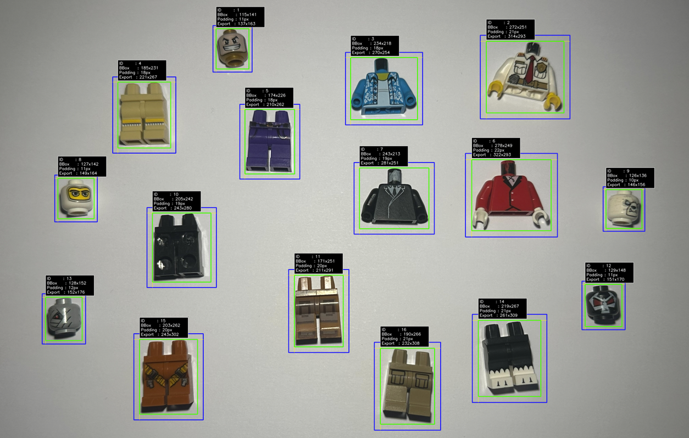
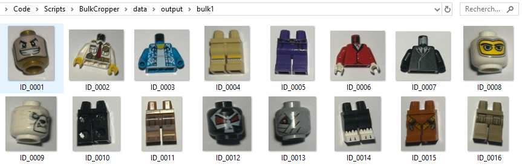

# BulkCropper

**BulkCropper** is a lightweight computer vision tool written in Python that automatically detects, segments and crops multiple objects from a single image. **Now with an optional Brickognize API integration.**

While the project is primarily designed for LEGO parts, the underlying detection pipeline is generic enough to work with many other isolated objects placed on a clean background.

The goal is simple:

- Drop one or multiple images into the input folder.
- Run the application.
- Retrieve every detected object as an individual PNG.

The project intentionally keeps its dependency stack minimal, relying only on:

- Python
- OpenCV
- NumPy

> No machine learning model, no neural network and no external API are required for the core functionality.


## Features:

- Detects objects in bulk images
- Multiple input formats
- Extracts individual crops with padding
- Generates debug overlays
- Lightweight dependency stack
- Designed for LEGO datasets but applicable to many object types
- **Optional Brickognize API integration (v2)**

---

<p align="center">
  
</p>

<p align="center">
  
</p>

---

## Supported input formats

BulkCropper currently accepts:

- .png
- .jpg
- .jpeg
- .bmp
- .webp

> Every detected object is exported as an individual .png with transparency.

---

## 🛠 Script Setup

### Requirements:
- Python 3.11+
- opencv-python
- numpy

### Installation :

```
git clone https://github.com/cfrBernard/BulkCropper.git
cd BulkCropper
```
```
pip install -e .
```

> **Note**: Using a .venv is highly recommended.

---

## Configuration

**Most users will never need to modify the configuration**. However, difficult images *(or setup)* may require fine tuning.

> You can find a debugging and configuration guide [here](docs/config-guide.md).

---

## How to Use:

#### 1. Place your input images inside `data/input/`

#### 2. Then run:

```
BulkCropper crop
```

#### 3. Detected objects will be exported to `data/output/<image_name>/`

> No additional arguments are required.

---

## Preparing your images

Although the detection pipeline is designed to be robust, image quality has a direct impact on segmentation accuracy.

For best results, **follow these recommendations**.

### 1. Use a matte white background

A simple sheet of white paper works perfectly. Avoid glossy or reflective surfaces whenever possible.

---

### 2. Use diffuse lighting

The algorithm can handle imperfect lighting conditions, but a soft and evenly distributed light source will significantly improve detection quality.

> Hard shadows should be avoided whenever possible.

---

### 3. Leave space between objects

Objects should not touch each other.

Keeping a small gap between pieces greatly improves contour extraction and prevents merged detections.

---

### 4. Keep a consistent resolution

BulkCropper has been tested on a specific resolution range where segmentation performs reliably.

> Recommended resolutions and limits will be documented in future releases.

---

## ⚠ Current limitations

BulkCropper assumes:

- a relatively clean background
- separated objects
- limited occlusion
- visible object contours

Images with overlapping objects may produce merged detections.

> Future versions will improve these edge cases.

---

## Performance

The project is designed around OpenCV and NumPy operations, allowing efficient processing without requiring GPU acceleration.

Performance mainly depends on:

- image resolution
- number of detected objects
- morphology settings
- contour complexity

---

## Integrations (v2)

BulkCropper now supports optional external integrations.

- Brickognize API: LEGO part identification from cropped images

👉 See documentation: [`docs/integrations/brickognize.md`](docs/integrations/brickognize.md)

---

## Notes
- You can find a [debugging and configuration guide here](docs/config-guide.md).
- If you are interested in the roadmap and want to know [what's coming](docs/roadmap.md).
- If you prefer a dev oriented overview, you can go to the [dev insight file](docs/dev-insight.md).
- For more information about the version, please refer to the [changelog](docs/CHANGELOG.md) section.
- This project is licensed under the MIT License. See the [LICENSE](./LICENSE.md) file for details.

## 🤝 Contact
For issues, suggestions, or contributions, feel free to open an issue on the GitHub repository.
