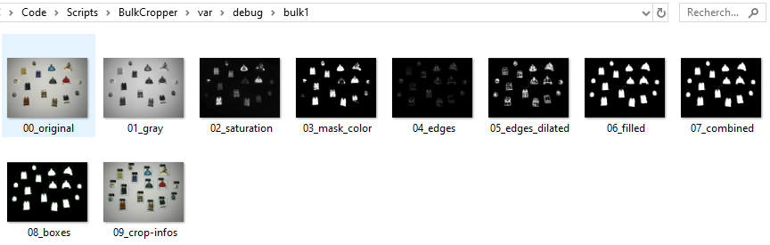
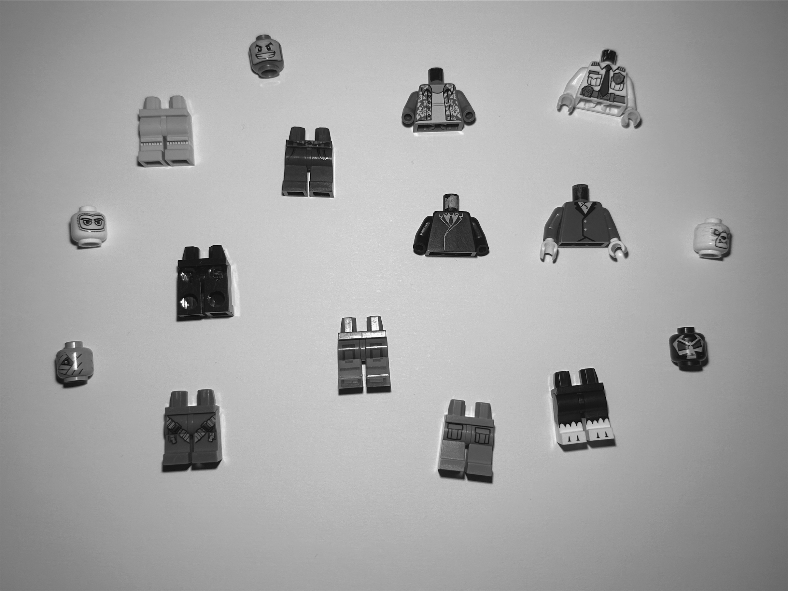
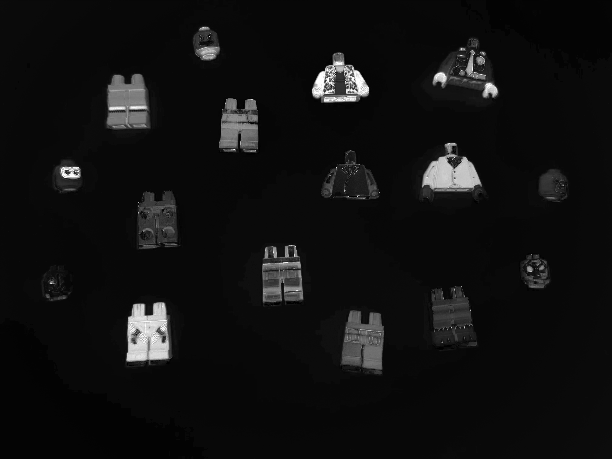
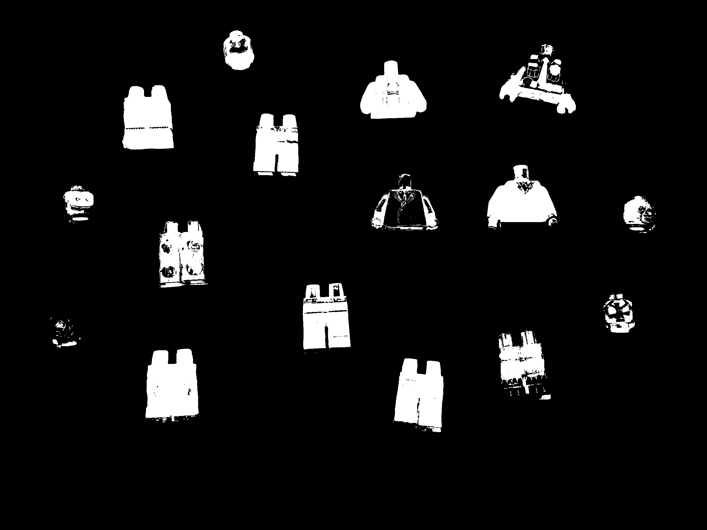
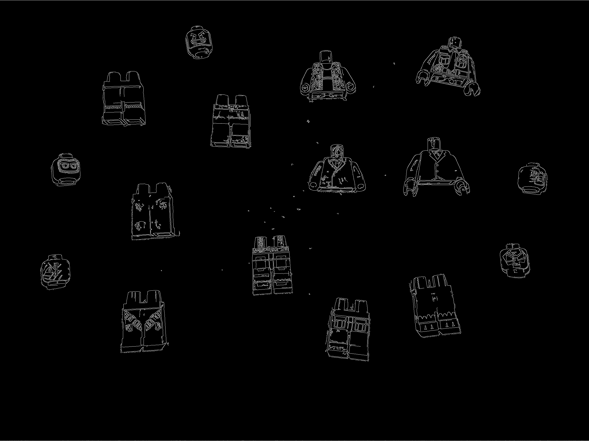
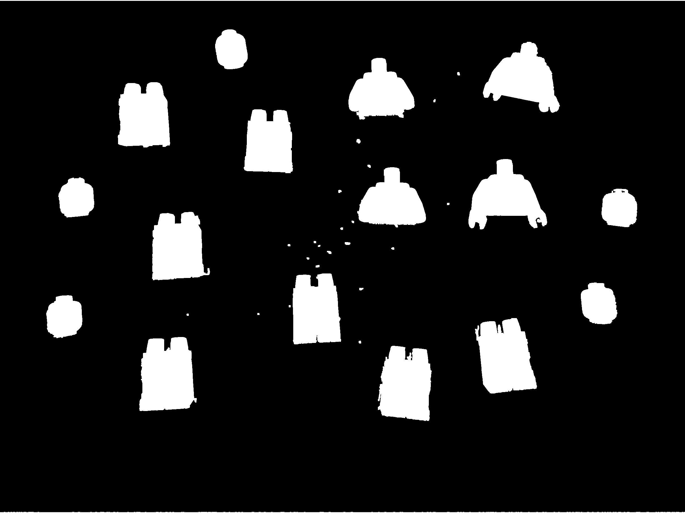
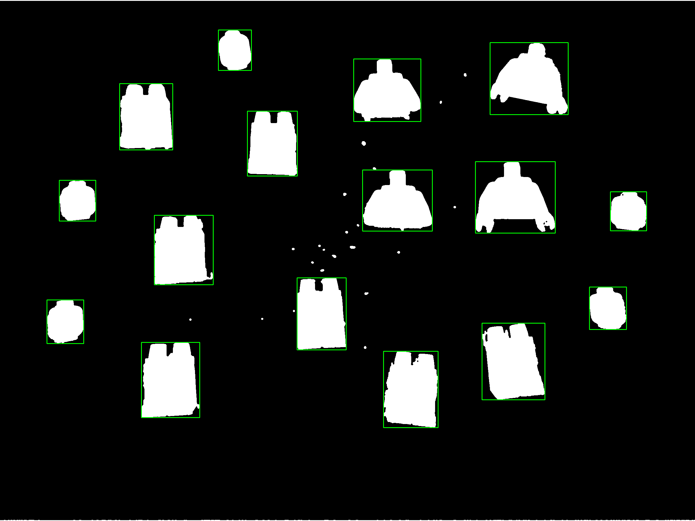

# Configuration & Debug Guide

BulkCropper is designed to work out of the box with minimal configuration. **In most cases, no parameter adjustment is required to obtain reliable results**.

However, image quality, lighting conditions, resolutions and object arrangement can vary significantly from one dataset to another. For this reason, the entire detection pipeline can be fine-tuned through the Config class.

**As a general rule**:

- **If objects are missing**, inspect the color segmentation.
- **If contours are incomplete**, inspect the edge detection.
- **If objects merge together**, inspect the combined mask.
- **If crops look incorrect**, inspect the bounding boxes and crop information.

Rather than adjusting parameters blindly, **use the debug outputs** to understand how each processing stage behaves. In most cases, a small configuration change is enough to significantly improve detection quality.

---

### ⚠ Before modifying any parameter, it is recommended to first enable:

```python
debug = True # inside src/BulkCropper/core/config.py
```

Then, running the application will generate intermediate processing steps inside `var/debug/<image_name>/`

---

## Table of content

### [Understanding the debug output](#debug-output)

  - [Original input](#original-input)
  - [Grayscale](#grayscale)
  - [Saturation](#saturation)
  - [Mask color](#mask-color)
  - [Initial Edges](#initial-edges)
  - [Edges Dilated](#edges-dilated)
  - [Filled](#filled)
  - [Filled + Mask color](#filled--mask-color)
  - [Box overview](#box-overview)
  - [Global infos](#global-infos)

### [Understanding the Configuration](#configuration)

  - [Default Config](#default-configpy)
  - [Parameter reference](#parameter-reference)

---

## Debug output

<p align="center">
  
</p>

> These images make it much easier to understand which stage of the pipeline needs adjustment.

---

### Original input

The original input image without any modification.

<p align="center">
  
</p>

> Use it as a reference when comparing the following processing steps.

---

### Grayscale

The grayscale version of the input image.

<p align="center">
  
</p>

> This simplifies the image by removing color information and is mainly used for edge detection.

---

### Saturation

Visualization of the saturation channel extracted from the image.

<p align="center">
  
</p>

> Highly saturated objects appear brighter, while white or low-saturation areas become darker. This step helps isolate colorful objects from the white background.

---

### Mask color

Binary mask generated from the saturation threshold.

<p align="center">
  
</p>

> White pixels represent regions detected as potential objects, while black pixels are considered background. If objects disappear or merge here, adjusting saturation_threshold is usually the first thing to try.

---

### Initial Edges

Edges detected using the Canny edge detector.

<p align="center">
  
</p>

> This image highlights object contours independently of their colors and helps recover details that color segmentation alone may miss.

---

### Edges Dilated

Dilated version of the edge map.

<p align="center">
  
</p>

> Edge expansion closes small gaps and creates more continuous contours, improving object reconstruction. If contours appear fragmented, increasing dilation parameters may help.

---

### Filled

Filled contours generated from the detected edges.

<p align="center">
  
</p>

> Open contours are converted into solid shapes that can later be merged with the color mask. This represents the geometric interpretation of detected objects.

---

### Filled + Mask color

Final segmentation mask obtained by combining color-based detection and edge-based reconstruction.

<p align="center">
  
</p>

> This is the most important debug image. Ideally, every object should appear as one clean white blob on a black background, completely separated from neighboring objects Most configuration adjustments should be evaluated by inspecting this image.

---

### Box overview

Bounding boxes drawn on the final segmentation mask.

<p align="center">
  
</p>

> Each detected connected component receives its own rectangle, allowing you to verify that every object has been detected individually. Missing or merged boxes usually indicate a segmentation issue rather than a cropping issue.

---

### Global infos

Visualization of the final export information overlaid on the original image.

<p align="center">
  
</p>

For every detected object, the following elements are displayed:

- 🟩 **Green rectangle** – Detected bounding box.
- 🟦 **Blue rectangle** – Actual exported crop including padding.
- 🟨 **Yellow guide lines** – Visual representation of the added padding between the bounding box and the exported image.
- 🆔 **Object ID** – Unique identifier assigned during processing.
- 📦 **Bounding box size** – Original detected width × height.
- ↔️ **Applied padding** – Number of pixels added around the object.
- 🖼️ **Final export size** – Dimensions of the generated PNG after padding.

> This image is particularly useful for validating crop quality and ensuring that exported objects have enough margin without wasting unnecessary space.

---

## Configuration

The entire detection pipeline can be configured through:

```
src/BulkCropper/core/config.py
```

---

## Default Config.py

```python
from dataclasses import dataclass

@dataclass
class Config:

    # =========================
    # IO
    # =========================
    input_path: str = "data/input"
    output_path: str = "data/output"
    debug_path: str = "var/debug"
    
    debug: bool = True

    # =========================
    # SEGMENTATION COLOR
    # =========================
    saturation_threshold: int = 40

    # =========================
    # EDGE SYSTEM
    # =========================
    canny_low: int = 40
    canny_high: int = 120

    edge_kernel_size: int = 3
    edge_dilate_iterations: int = 2

    gaussian_blur = 5

    # =========================
    # MORPHOLOGY
    # =========================
    morph_kernel: int = 3
    morph_iterations: int = 2

    # =========================
    # FILTERING
    # =========================
    min_area: int = 300
    max_area: int = 10_000_000

    border_margin: int = 4
    remove_border_objects: bool = True

    # =========================
    # CROP
    # =========================
    padding_ratio: float = 0.08
    min_padding: int = 10
```

---

## Parameter reference

| Parameter | Description |
|------------|------------------------------------------------|
| `saturation_threshold` | Controls color segmentation sensitivity. Higher values ignore low-saturation pixels. |
| `canny_low` / `canny_high` | Thresholds used by the Canny edge detector. |
| `edge_kernel_size` | Kernel size used during edge expansion. |
| `edge_dilate_iterations` | Number of edge dilation passes. |
| `gaussian_blur` | Blur radius applied before edge detection to reduce noise. |
| `morph_kernel` | Morphological kernel size used to clean masks. |
| `morph_iterations` | Number of morphology iterations applied. |
| `min_area` | Rejects detections smaller than this area. |
| `max_area` | Rejects detections larger than this area. |
| `border_margin` | Margin used to identify objects touching image borders. |
| `remove_border_objects` | Automatically removes objects intersecting image borders. |
| `padding_ratio` | Relative padding added around exported crops. |
| `min_padding` | Minimum padding (in pixels) applied to every crop. |

---
